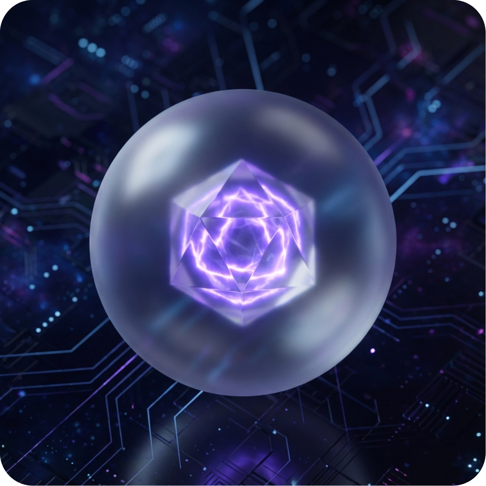

# SoftReveal

**Reveal less. Engage more.**

SoftReveal is a web-based tool for controlling the pace of information disclosure, designed for screen recording and visual storytelling. It's not just an "image blurring" app—it's a presentation tool that helps you maintain audience engagement by revealing content at the right moment.



## 🌟 Features

- **📋 Clipboard Ready** - Paste images directly from your clipboard or drag and drop files
- **🎨 Custom Blur** - Define blur areas and intensity precisely to your needs
- **👆 Click to Reveal** - Reveal hidden areas one by one during your recording or stream
- **🎭 Multiple Reveal Animations** - Fade out, disappear, zoom out, swipe, and peel effects
- **🎯 Snap to Edges** - Smart snapping for precise alignment
- **🌐 Multi-language** - Supports English, Vietnamese, and Traditional Chinese
- **💾 Settings Persistence** - Your preferences are saved automatically
- **🎨 Custom Backgrounds** - Choose from preset colors or use your own

## 🎯 Who is it for?

- **Content Creators** - Keep viewers hooked for those "A-ha!" moments in your breakdown videos
- **Educators & Mentors** - Explain complex documents by revealing parts as you speak
- **Tech & Data People** - Share logs or reports without leaking sensitive info immediately
- **Social Media Analysts** - Tell stories through comment chains or tweet threads with rhythm

## 🚀 Live Demo

Try it now: [https://softreveal.mttp.com.vn/](https://softreveal.mttp.com.vn/)

## 🛠️ Installation

### Option 1: Use Online (Recommended)
Simply visit [https://softreveal.mttp.com.vn/](https://softreveal.mttp.com.vn/) and start using it immediately.

### Option 2: Run Locally
1. Clone this repository:
   ```bash
   git clone https://github.com/bmtriet/SoftReveal.git
   cd SoftReveal
   ```

2. Open `index.html` in your browser:
   ```bash
   # On Windows
   start index.html
   
   # On macOS
   open index.html
   
   # On Linux
   xdg-open index.html
   ```

3. Or serve it with a local server:
   ```bash
   # Using Python 3
   python -m http.server 8000
   
   # Using Node.js (http-server)
   npx http-server
   ```

## 📖 How to Use

1. **Load an Image**
   - Paste from clipboard (Ctrl+V / Cmd+V)
   - Drag and drop an image file
   - The image will appear in the workspace

2. **Create Blur Areas**
   - Click and drag to create rectangular blur areas
   - Press `R` for rectangle or `C` for circle shapes
   - Adjust blur intensity with the slider
   - Right-click on blur areas to duplicate or delete

3. **Present Mode**
   - Click the "Present Mode" button or press `Space`
   - Click on blurred areas to reveal them with animations
   - Right-click to exit presentation mode

4. **Customize**
   - Change background color
   - Adjust zoom level
   - Select reveal animation style
   - Enable snap-to-edges for precise alignment

## ⌨️ Keyboard Shortcuts

| Key | Action |
|-----|--------|
| `Space` | Toggle between Edit and Present mode |
| `R` | Select Rectangle tool |
| `C` | Select Circle tool |
| `Ctrl+V` / `Cmd+V` | Paste image from clipboard |

## 🎨 Tech Stack

- **Pure HTML/CSS/JavaScript** - No frameworks, no dependencies
- **Phosphor Icons** - Beautiful icon library
- **CSS Glassmorphism** - Modern UI design
- **LocalStorage API** - Settings persistence

## 🌍 Supported Languages

- 🇬🇧 English
- 🇻🇳 Vietnamese (Tiếng Việt)
- 🇹🇼 Traditional Chinese (繁體中文)

## 🤝 Contributing

Contributions are welcome! Please feel free to submit a Pull Request.

1. Fork the repository
2. Create your feature branch (`git checkout -b feature/AmazingFeature`)
3. Commit your changes (`git commit -m 'Add some AmazingFeature'`)
4. Push to the branch (`git push origin feature/AmazingFeature`)
5. Open a Pull Request

## 💖 Support the Project

If you find SoftReveal useful, consider supporting its development:

[](https://paypal.me/softreveal)

Your support helps maintain and improve SoftReveal!

## 📄 License

This project is open source and available under the [MIT License](LICENSE).

## 🙏 Acknowledgments

- Design inspired by modern glassmorphism trends
- Icons by [Phosphor Icons](https://phosphoricons.com/)
- Built with ❤️ for content creators and educators

## 📞 Contact

- **Website**: [https://softreveal.mttp.com.vn/](https://softreveal.mttp.com.vn/)
- **GitHub**: [https://github.com/bmtriet/SoftReveal](https://github.com/bmtriet/SoftReveal)
- **PayPal**: [https://paypal.me/softreveal](https://paypal.me/softreveal)

---

**Made with ❤️ for the era of visual storytelling**

> "Attention isn't lost because of bad content, but because it was revealed too early."
